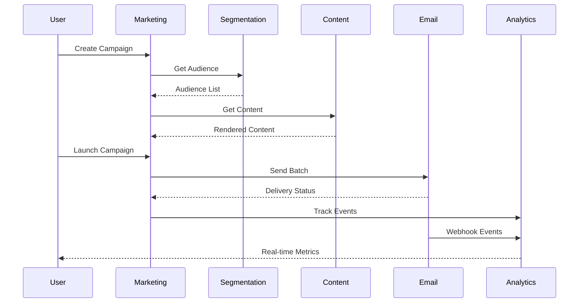
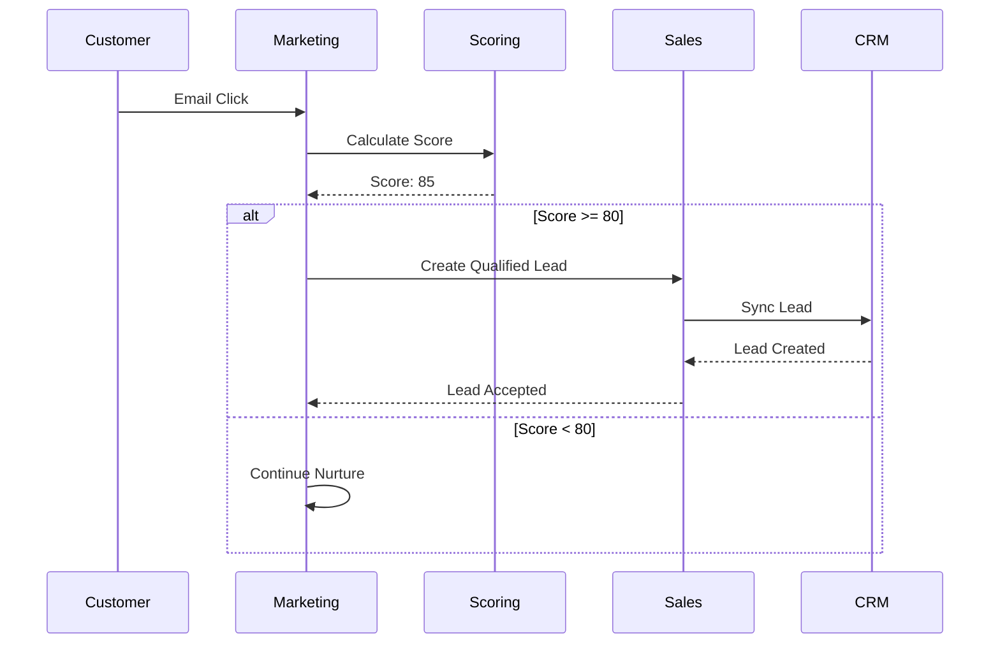

# Marketing System Integration Guide

## Overview

This document describes how the Marketing System integrates with other ionoi-inc systems and external services.

## System Dependencies

### Upstream Dependencies

#### Customer Experience System
**Purpose**: Source of truth for customer profiles and preferences

**Integration Type**: REST API + Event Stream

**Data Flow**:
```
Customer Experience → Marketing System
- Customer profile updates
- Preference changes
- Consent management
- Communication history
```

**API Contract**:
```typescript
// Get customer profile
GET /api/v1/customers/:id
Response: {
  id: string;
  email: string;
  phone?: string;
  firstName: string;
  lastName: string;
  preferences: {
    emailOptIn: boolean;
    smsOptIn: boolean;
    pushOptIn: boolean;
    frequency: 'daily' | 'weekly' | 'monthly';
    categories: string[];
  };
  attributes: Record<string, any>;
  createdAt: Date;
  updatedAt: Date;
}

// Batch get customers (for segmentation)
POST /api/v1/customers/batch
Request: { ids: string[] }
Response: { customers: Customer[] }
```

**Event Subscriptions**:
```
customer.created
customer.updated
customer.preferences.changed
customer.consent.granted
customer.consent.revoked
```

#### Sales System
**Purpose**: Lead qualification and opportunity tracking

**Integration Type**: REST API + Event Stream

**Data Flow**:
```
Marketing System → Sales System
- Qualified leads
- Lead scores
- Campaign attribution
- Engagement history

Sales System → Marketing System
- Opportunity status
- Deal closed events
- Sales feedback on lead quality
```

**API Contract**:
```typescript
// Create qualified lead
POST /api/v1/leads
Request: {
  customerId: string;
  source: string;
  campaign: string;
  score: number;
  attributes: Record<string, any>;
}

// Update lead status
PUT /api/v1/leads/:id
Request: {
  status: 'new' | 'contacted' | 'qualified' | 'converted' | 'lost';
  notes?: string;
}
```

#### Content Integrated System
**Purpose**: Digital asset management and content delivery

**Integration Type**: REST API + CDN

**Data Flow**:
```
Content System → Marketing System
- Content assets (images, videos, documents)
- Content metadata
- Personalization rules
- A/B test variants
```

**API Contract**:
```typescript
// Get content asset
GET /api/v1/content/:id
Response: {
  id: string;
  type: 'image' | 'video' | 'document' | 'html';
  url: string;
  cdnUrl: string;
  metadata: {
    title: string;
    description: string;
    tags: string[];
    size: number;
    format: string;
  };
  versions: {
    id: string;
    url: string;
    createdAt: Date;
  }[];
}

// Render personalized content
POST /api/v1/content/render
Request: {
  templateId: string;
  variables: Record<string, any>;
}
Response: {
  html: string;
  plainText: string;
}
```

### Downstream Consumers

#### Analytics Dashboard
**Purpose**: Real-time campaign metrics and business intelligence

**Integration Type**: Event Stream + REST API

**Data Flow**:
```
Marketing System → Analytics Dashboard
- Campaign events
- Performance metrics
- Attribution data
- Funnel analytics
```

**Events Published**:
```
marketing.campaign.launched
marketing.campaign.completed
marketing.email.sent
marketing.email.delivered
marketing.email.opened
marketing.email.clicked
marketing.email.bounced
marketing.conversion.tracked
```

#### Billing System
**Purpose**: Campaign spend tracking and budget management

**Integration Type**: REST API

**Data Flow**:
```
Marketing System → Billing System
- Campaign costs
- Channel costs (email, SMS, ads)
- Budget utilization
- Vendor invoices
```

**API Contract**:
```typescript
// Record campaign spend
POST /api/v1/billing/charges
Request: {
  campaignId: string;
  amount: number;
  currency: string;
  category: 'email' | 'sms' | 'ads' | 'other';
  vendorId: string;
  timestamp: Date;
}
```

#### Support System
**Purpose**: Customer communication history and context

**Integration Type**: Event Stream

**Data Flow**:
```
Marketing System → Support System
- Customer engagement history
- Campaign interactions
- Unsubscribe events
- Complaint tracking
```

## External Service Integrations

### Email Service Providers

#### SendGrid
**Purpose**: Transactional and bulk email delivery

**Configuration**:
```yaml
sendgrid:
  api_key: ${SENDGRID_API_KEY}
  sender_domain: marketing.ionoi.io
  webhook_url: ${BASE_URL}/webhooks/sendgrid
  ip_pool: marketing-pool
```

**API Usage**:
```typescript
// Send email
POST https://api.sendgrid.com/v3/mail/send
Headers: { Authorization: Bearer ${API_KEY} }
Body: {
  personalizations: [{
    to: [{ email: string }],
    dynamic_template_data: Record<string, any>
  }],
  from: { email: string, name: string },
  template_id: string,
  tracking_settings: {
    click_tracking: { enable: true },
    open_tracking: { enable: true }
  }
}

// Webhook events received
POST /webhooks/sendgrid
Body: [{
  event: 'delivered' | 'opened' | 'clicked' | 'bounced' | 'spam_report',
  email: string,
  timestamp: number,
  campaign_id: string
}]
```

#### Amazon SES
**Purpose**: High-volume email delivery with cost optimization

**Configuration**:
```yaml
aws_ses:
  region: us-east-1
  access_key: ${AWS_ACCESS_KEY}
  secret_key: ${AWS_SECRET_KEY}
  configuration_set: marketing-campaigns
```

### SMS Gateway

#### Twilio
**Purpose**: SMS and MMS delivery

**Configuration**:
```yaml
twilio:
  account_sid: ${TWILIO_ACCOUNT_SID}
  auth_token: ${TWILIO_AUTH_TOKEN}
  messaging_service_sid: ${TWILIO_MSG_SERVICE_SID}
  webhook_url: ${BASE_URL}/webhooks/twilio
```

**API Usage**:
```typescript
// Send SMS
POST https://api.twilio.com/2010-04-01/Accounts/${ACCOUNT_SID}/Messages.json
Body: {
  To: string,
  From: string,
  Body: string,
  MessagingServiceSid: string,
  StatusCallback: string
}

// Webhook events
POST /webhooks/twilio
Body: {
  MessageSid: string,
  MessageStatus: 'sent' | 'delivered' | 'failed',
  To: string,
  From: string
}
```

### Social Media Platforms

#### Meta (Facebook/Instagram)
**Purpose**: Social media advertising and organic posting

**Configuration**:
```yaml
meta:
  app_id: ${META_APP_ID}
  app_secret: ${META_APP_SECRET}
  access_token: ${META_ACCESS_TOKEN}
  ad_account_id: ${META_AD_ACCOUNT_ID}
```

**API Usage**:
```typescript
// Create ad campaign
POST https://graph.facebook.com/v18.0/${AD_ACCOUNT_ID}/campaigns
Body: {
  name: string,
  objective: string,
  status: 'ACTIVE' | 'PAUSED',
  special_ad_categories: string[]
}

// Get campaign insights
GET https://graph.facebook.com/v18.0/${CAMPAIGN_ID}/insights
Params: {
  fields: 'impressions,clicks,spend,conversions',
  date_preset: 'last_7d'
}
```

#### LinkedIn Marketing API
**Purpose**: B2B advertising and sponsored content

**Configuration**:
```yaml
linkedin:
  client_id: ${LINKEDIN_CLIENT_ID}
  client_secret: ${LINKEDIN_CLIENT_SECRET}
  access_token: ${LINKEDIN_ACCESS_TOKEN}
  organization_id: ${LINKEDIN_ORG_ID}
```

### Analytics & Attribution

#### Google Analytics
**Purpose**: Website behavior tracking and conversion attribution

**Integration Type**: Client-side tracking + Measurement Protocol

**Configuration**:
```yaml
google_analytics:
  measurement_id: ${GA_MEASUREMENT_ID}
  api_secret: ${GA_API_SECRET}
```

**Event Tracking**:
```typescript
// Send conversion event
POST https://www.google-analytics.com/mp/collect
Body: {
  client_id: string,
  events: [{
    name: 'purchase',
    params: {
      campaign_id: string,
      transaction_id: string,
      value: number,
      currency: string
    }
  }]
}
```

#### Mixpanel
**Purpose**: Product analytics and user behavior tracking

**Configuration**:
```yaml
mixpanel:
  token: ${MIXPANEL_TOKEN}
  api_secret: ${MIXPANEL_API_SECRET}
```

## Event Schemas

### Campaign Events

#### Campaign Launched
```json
{
  "event_type": "marketing.campaign.launched",
  "version": "1.0",
  "timestamp": "2026-02-11T07:00:00Z",
  "data": {
    "campaign_id": "cmp_123",
    "name": "Spring Promotion",
    "type": "email",
    "segment_id": "seg_456",
    "segment_size": 50000,
    "schedule": {
      "start_date": "2026-02-15T10:00:00Z",
      "timezone": "America/New_York"
    },
    "budget": {
      "total": 5000,
      "currency": "USD"
    }
  },
  "metadata": {
    "created_by": "user_789",
    "tenant_id": "tenant_001"
  }
}
```

#### Email Opened
```json
{
  "event_type": "marketing.email.opened",
  "version": "1.0",
  "timestamp": "2026-02-15T10:05:23Z",
  "data": {
    "campaign_id": "cmp_123",
    "customer_id": "cust_456",
    "email": "customer@example.com",
    "message_id": "msg_789",
    "ip_address": "192.168.1.1",
    "user_agent": "Mozilla/5.0...",
    "device_type": "mobile",
    "location": {
      "country": "US",
      "city": "New York"
    }
  }
}
```

### Customer Events

#### Customer Converted
```json
{
  "event_type": "marketing.customer.converted",
  "version": "1.0",
  "timestamp": "2026-02-15T11:30:00Z",
  "data": {
    "customer_id": "cust_456",
    "campaign_id": "cmp_123",
    "conversion_type": "purchase",
    "value": 99.99,
    "currency": "USD",
    "attribution": {
      "first_touch": "cmp_100",
      "last_touch": "cmp_123",
      "model": "linear"
    }
  }
}
```

## Data Flow Diagrams

### Campaign Execution Flow


### Lead Qualification Flow


## Integration Checklist

### New Integration Setup
- [ ] Create API credentials/tokens
- [ ] Configure webhook endpoints
- [ ] Set up rate limiting
- [ ] Implement retry logic
- [ ] Add error monitoring
- [ ] Document API contract
- [ ] Create integration tests
- [ ] Set up staging environment test
- [ ] Monitor initial production traffic
- [ ] Document runbook for failures

### Testing Strategy
- **Unit Tests**: Mock external API responses
- **Integration Tests**: Use sandbox/test accounts
- **Load Tests**: Verify rate limit handling
- **Failover Tests**: Simulate external service downtime

## Troubleshooting

### Common Integration Issues

#### Email Delivery Issues
- **Symptom**: Low delivery rate
- **Check**: SPF/DKIM/DMARC records, IP reputation
- **Solution**: Warm up IPs, improve list hygiene

#### Webhook Delays
- **Symptom**: Events received late
- **Check**: Webhook endpoint performance, queue backlog
- **Solution**: Scale webhook handlers, add caching

#### API Rate Limits
- **Symptom**: 429 responses from external services
- **Check**: Request rate, burst patterns
- **Solution**: Implement exponential backoff, request batching

## Support & Resources

- **Integration Documentation**: `/docs/integrations/`
- **API Playground**: `https://api-sandbox.ionoi.io`
- **Postman Collection**: `/docs/postman/`
- **Support Email**: `integrations@ionoi.io`
- **Slack Channel**: `#marketing-integrations`
