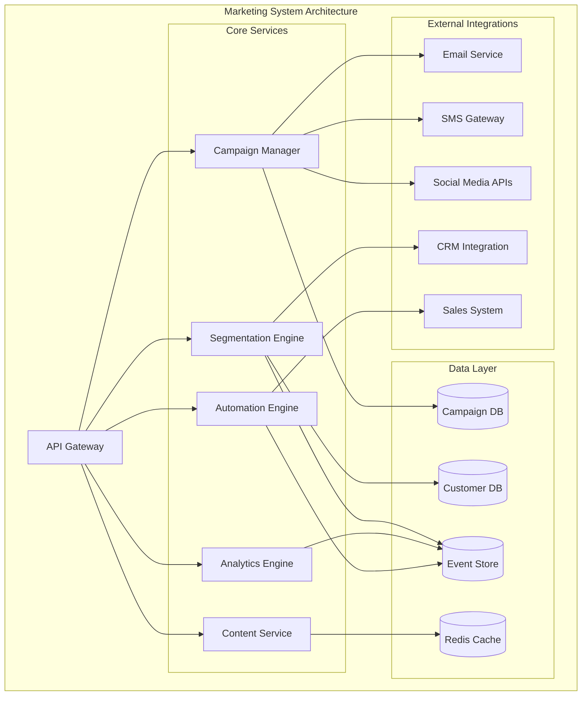

# Marketing System Architect

## Overview

The Marketing System Architect is a comprehensive marketing automation and campaign management platform designed to orchestrate multi-channel marketing operations, customer segmentation, campaign analytics, and content delivery at scale.

## Purpose and Capabilities

- **Campaign Management**: Create, schedule, and orchestrate multi-channel marketing campaigns across email, SMS, push notifications, and social media
- **Customer Segmentation**: Advanced audience segmentation using behavioral data, demographics, and predictive analytics
- **Marketing Analytics**: Real-time campaign performance tracking, attribution modeling, and ROI analysis
- **Content Management**: Centralized content library with versioning, A/B testing, and personalization
- **Lead Scoring**: AI-powered lead scoring and qualification based on engagement patterns
- **Marketing Automation**: Trigger-based workflows, drip campaigns, and customer journey orchestration

## Architecture Diagram



## Tech Stack

### Backend
- **Runtime**: Node.js 20 LTS
- **Framework**: Express.js with TypeScript
- **API**: RESTful + GraphQL endpoints
- **Authentication**: JWT with OAuth2.0

### Data Storage
- **Primary Database**: PostgreSQL 15 (customer and campaign data)
- **Event Store**: Apache Kafka (event streaming)
- **Cache**: Redis 7 (session and real-time data)
- **Analytics**: ClickHouse (time-series analytics)

### Infrastructure
- **Container Orchestration**: Kubernetes
- **Message Queue**: RabbitMQ
- **CDN**: Cloudflare
- **Object Storage**: AWS S3 (media assets)

### Monitoring & Observability
- **APM**: New Relic
- **Logging**: ELK Stack (Elasticsearch, Logstash, Kibana)
- **Metrics**: Prometheus + Grafana
- **Error Tracking**: Sentry

## Integration Points

### Upstream Dependencies
- **Customer Experience System** - Customer profile data and preferences
- **Sales System** - Lead handoff and opportunity tracking
- **Content Integrated System** - Content library and digital assets

### Downstream Consumers
- **Analytics Dashboard** - Real-time campaign metrics
- **Billing System** - Campaign spend tracking and attribution
- **Support System** - Customer communication history

### External Services
- **Email**: SendGrid, Amazon SES
- **SMS**: Twilio, Vonage
- **Social Media**: Facebook/Meta API, LinkedIn API, Twitter API
- **Analytics**: Google Analytics, Mixpanel

## API Endpoints

### Campaign Management
```
POST   /api/v1/campaigns              Create new campaign
GET    /api/v1/campaigns              List all campaigns
GET    /api/v1/campaigns/:id          Get campaign details
PUT    /api/v1/campaigns/:id          Update campaign
DELETE /api/v1/campaigns/:id          Delete campaign
POST   /api/v1/campaigns/:id/launch   Launch campaign
POST   /api/v1/campaigns/:id/pause    Pause campaign
GET    /api/v1/campaigns/:id/metrics  Get campaign metrics
```

### Audience Segmentation
```
POST   /api/v1/segments               Create segment
GET    /api/v1/segments               List segments
GET    /api/v1/segments/:id           Get segment details
PUT    /api/v1/segments/:id           Update segment
GET    /api/v1/segments/:id/count     Get segment size
POST   /api/v1/segments/:id/refresh   Refresh segment
```

### Marketing Automation
```
POST   /api/v1/workflows              Create automation workflow
GET    /api/v1/workflows              List workflows
GET    /api/v1/workflows/:id          Get workflow details
PUT    /api/v1/workflows/:id          Update workflow
POST   /api/v1/workflows/:id/enable   Enable workflow
POST   /api/v1/workflows/:id/disable  Disable workflow
```

### Analytics
```
GET    /api/v1/analytics/campaigns/:id      Campaign performance
GET    /api/v1/analytics/attribution        Attribution report
GET    /api/v1/analytics/funnel            Conversion funnel
GET    /api/v1/analytics/cohort            Cohort analysis
```

## Deployment Strategy

### Environments
1. **Development** - Local development with Docker Compose
2. **Staging** - Kubernetes cluster mirroring production
3. **Production** - Multi-region Kubernetes deployment

### Deployment Pipeline
```
Code Push → GitHub Actions → Build Docker Image → 
Push to Registry → Run Tests → Deploy to Staging → 
Manual Approval → Blue-Green Deploy to Production → 
Health Check → Route Traffic
```

### Scaling Strategy
- **Horizontal Pod Autoscaling**: CPU > 70% triggers scale-out
- **Database Read Replicas**: 3 read replicas for query distribution
- **CDN**: Static assets and API responses cached at edge
- **Message Queue**: Auto-scaling consumer workers based on queue depth

### Disaster Recovery
- **RTO**: 15 minutes
- **RPO**: 5 minutes
- **Backup Strategy**: Continuous WAL archiving + daily snapshots
- **Failover**: Automated DNS failover to DR region

## Security

- **Authentication**: OAuth 2.0 with JWT tokens
- **Authorization**: Role-Based Access Control (RBAC)
- **Encryption**: TLS 1.3 in transit, AES-256 at rest
- **Compliance**: GDPR, CCPA, CAN-SPAM compliant
- **Data Privacy**: PII tokenization and data anonymization
- **Rate Limiting**: API rate limits per tenant

## Performance SLAs

- **API Response Time**: p95 < 200ms
- **Campaign Launch Time**: < 5 minutes
- **Segment Refresh**: < 30 seconds for up to 1M records
- **Event Processing**: < 1 second end-to-end latency
- **System Uptime**: 99.9% availability

## Getting Started

### Prerequisites
```bash
- Node.js 20+
- Docker & Docker Compose
- PostgreSQL 15
- Redis 7
- kubectl (for production deployment)
```

### Local Development
```bash
# Clone repository
git clone https://github.com/ionoi-inc/marketing-system-architect.git
cd marketing-system-architect

# Install dependencies
npm install

# Set up environment
cp .env.example .env

# Start services
docker-compose up -d

# Run migrations
npm run migrate

# Start development server
npm run dev
```

### Running Tests
```bash
npm run test              # Unit tests
npm run test:integration  # Integration tests
npm run test:e2e          # End-to-end tests
npm run test:coverage     # Coverage report
```

## Documentation

- [Architecture Documentation](./ARCHITECTURE.md)
- [Integration Guide](./INTEGRATION.md)
- [Workflows & CI/CD](./WORKFLOWS.md)
- [API Documentation](./docs/api/)
- [Deployment Guide](./docs/deployment/)

## Support

For issues, questions, or contributions:
- **Issues**: GitHub Issues
- **Discussions**: GitHub Discussions
- **Email**: engineering@ionoi.io
- **Slack**: #marketing-system-architect

## License

Proprietary - Copyright (c) 2026 ionoi-inc
